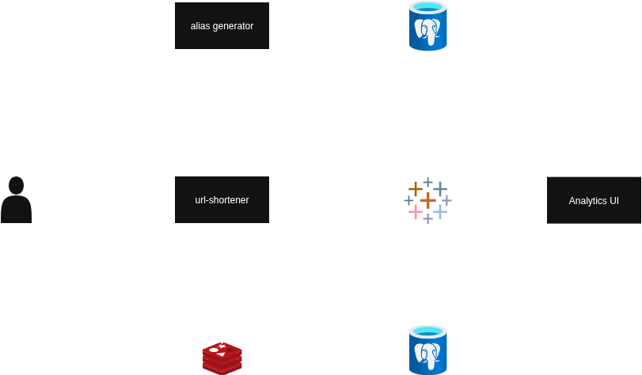

## Description

A scalable, ready-to-deploy URL shortener service built using NestJs. This project is designed to offer an easy-to-set-up URL shortening service with analytics infrastructure. It leverages Docker, PostgreSQL, and Redis to ensure a robust and scalable system.

## Table of Contents

- [Features](#features)
- [Architecture](#architecture)
- [Endpoints](#endpoints)
- [Getting Started](#getting-started)
  - [Prerequisites](#prerequisites)
  - [Installation](#installation)
- [Usage](#usage)
- [Local Development](#local-development)
- [Design Approach](#design-approach)
- [Scalability Solutions](#scalability-solutions)
- [Performance Benchmarks](#performance-benchmarks)
- [Further Optimizations](#further-optimizations)

## Features

- **Shorten URLs**: Generate unique and short aliases for URLs.
- **Analytics**: View analytics and metrics.
- **Scalable Architecture**: Designed to scale horizontally to handle increased load.
- **Docker Compose Setup**: Easy setup and deployment using Docker Compose.

## Architecture



This project follows a monorepo structure containing two main services:

**System Overview**:
The architecture consists of two microservices that communicate through NATS messaging:

1. **URL Shortener Service** (Port 3000):
   - Handles URL shortening requests and redirects
   - Uses PostgreSQL for persistent storage
   - Implements Redis caching for performance
   - Includes rate limiting for API protection

2. **Analytics Service** (Port 3001):
   - Processes click events via NATS subscriptions
   - Stores analytics data in PostgreSQL
   - Provides analytics endpoints for data retrieval

**Data Flow**:

- User requests flow through the URL shortener service
- Click events are published to NATS for analytics processing
- Both services share the same PostgreSQL database for data consistency
- Redis provides caching and rate limiting capabilities

1. **URL-Shortener Service**:
   - Saves aliases to storage and cache (for the first 24 hours).
   - Retrieves the full URL based on the alias and redirects to it.

2. **Alias-Gen Service**:
   - Uses a counter-based approach to generate aliases for full URLs.
   - Employs PostgreSQL to maintain the counter value.

## Endpoints

- _Url Shortener_: http://localhost:3000
- _Analytics_: http://localhost:3001

- **Create Alias**:
  - `POST /url`
  - Example Request Body: `{"url": "https://github.com/"}`
  - Example Response: `{'status': 'OK', 'alias': 'alias'}`

- **Redirect to Full URL**:
  - `GET /{alias}`
  - Redirects to the corresponding full URL.

- **Get clicks**:
  - `GET /analytics/clicks?alias={alias}`
  - Example Request/Response `
    [
    {
    "id": "214",
    "alias": "test-alias-2",
    "timestamp": "2024-01-01T13:00:00.000Z",
    "userAgent": "Mozilla/5.0 (iPhone; CPU iPhone OS 14_7_1 like Mac OS X) AppleWebKit/605.1.15",
    "ip": "192.168.1.4",
    "referrer": null,
    "latency": "80",
    "error": null
    },
    {
    "id": "213",
    "alias": "test-alias-2",
    "timestamp": "2024-01-01T12:00:00.000Z",
    "userAgent": "Mozilla/5.0 (X11; Linux x86_64) AppleWebKit/537.36",
    "ip": "192.168.1.3",
    "referrer": "https://facebook.com",
    "latency": "200",
    "error": null
    }
    ]
  `

- **Get stats**:
  - `GET /analytics/stats?alias={alias}`
  - Example Response: `{
  "totalClicks": 2,
  "uniqueIps": 2,
  "avgLatency": 140,
  "errorRate": 0,
  "clicksByHour": [
    {
      "hour": "2024-01-01T13:00:00.000Z",
      "count": 1
    },
    {
      "hour": "2024-01-01T12:00:00.000Z",
      "count": 1
    }
  ],
  "topReferrers": [
    {
      "referrer": "Direct",
      "count": 1
    },
    {
      "referrer": "https://facebook.com",
      "count": 1
    }
  ]
}`

## Getting Started

### Prerequisites

- Docker and Docker Compose installed on your machine.

### Installation

1. Clone the repository:
   ```bash
   git clone https://github.com/uttsap/url-shortener.git
   ```
2. Navigate to the project directory:
   ```bash
   cd url-shortener
   ```
3. Build and run the Docker Compose setup:
   ```bash
   docker-compose up --build -d
   ```

### Usage

1. Access the URL shortener service at [http://localhost:3000](http://localhost:3000).
2. For analytics and metrics, access at [http://localhost:3001](http://localhost:3001).
   - The service tracks `clicks`, which include information like:
     - Redirect Timestamp
     - Alias
     - User IP address
     - User Agent
     - Referrer
     - Latency of Redirect
     - Error If Exists

### Local Development

Follow the steps in the [Local Development Setup](./docs/LOCAL_DEVELOPMENT.md) document to set up the project for local development.

### Design Approach

#### URL Shortener Service Design

**Counter-Based Alias Generation**:

- Uses a PostgreSQL counter to generate sequential numeric IDs, then converts them to base62 for shorter representation
- **Trade-off**: Sequential IDs are predictable but provide guaranteed uniqueness and efficient storage
- **Alternative considered**: UUID-based approach would be more random but longer and harder to cache

**Caching Strategy**:

- Redis cache for the first 24 hours after creation to reduce database load
- **Trade-off**: Memory usage vs performance - newer URLs are accessed more frequently
- **Design decision**: 24-hour TTL balances cache efficiency with memory constraints

**Redis Rate Limiter**:

- Uses Redis-based rate limiting for distributed request throttling
- **Trade-off**: Additional Redis dependency vs distributed rate limiting capability
- **Benefit**: Shared rate limits across multiple instances and persistence across restarts

**Database Design**:

- Separate tables for URLs and counters to allow independent scaling
- **Trade-off**: Additional complexity vs better performance isolation
- **Benefit**: Counter table can be optimized separately for high-frequency updates

#### Analytics Service Design

**Event-Driven Architecture**:

- Uses NATS messaging for loose coupling between URL shortener and analytics
- **Trade-off**: Eventual consistency vs system decoupling
- **Benefit**: Analytics service can be scaled independently and won't impact URL shortening performance

**Click Tracking**:

- Captures comprehensive metadata (IP, User-Agent, Referrer, Latency)
- **Trade-off**: Privacy concerns vs detailed analytics
- **Design decision**: Store raw data for flexibility in future analytics queries

**Database Schema**:

- Denormalized click events for query performance
- **Trade-off**: Storage space vs query speed
- **Benefit**: Fast aggregation queries without complex joins

#### Overall Architecture Trade-offs

**Monorepo vs Microservices**:

- Monorepo structure for easier development and deployment
- **Trade-off**: Coupled releases vs development simplicity
- **Benefit**: Shared libraries and consistent tooling

**PostgreSQL vs NoSQL**:

- PostgreSQL for ACID compliance and relational queries
- **Trade-off**: Schema flexibility vs data consistency
- **Benefit**: Complex analytics queries and data integrity

**Docker Compose for Development**:

- Single command setup for all services
- **Trade-off**: Production complexity vs development ease
- **Benefit**: Consistent environment across team members

### Scalability Solutions

To ensure scalability and accommodate increasing user demand, employed the following strategies:

- **Horizontal Scaling :** The system is designed to scale horizontally, allowing us to add more servers or instances to handle increased traffic efficiently. This approach ensures that platform remains responsive even during periods of high demand.
- **Load Balancing :** We can utilize load balancers to distribute incoming traffic evenly across multiple servers or instances. This will help prevent any single server from becoming overwhelmed, improving overall system performance and reliability.
- **Caching :** Implemented caching mechanisms to store frequently accessed data, such as static content or database query results. By caching data at various layers of our infrastructure, we reduce the need for repeated computations or database accesses, thereby improving response times and reducing server load.
- **Asynchronous Processing :** For resource-intensive tasks or operations that can be performed asynchronously, we leverage asynchronous processing techniques. By offloading these tasks to background processes or separate service, we free up resources on the main application servers, improving overall system responsiveness.
- **Database Sharding :** As the volume of data grows, we employ database sharding techniques to horizontally partition our database across multiple servers. This allows us to distribute the database workload and queries more evenly, preventing any single database server from becoming a bottleneck.

### Performance Benchmarks

Load testing was performed using industry-standard tools including **wrk** for high-concurrency testing and **Apache Bench (ab)** for request rate analysis.

For detailed performance metrics, latency analysis, throughput measurements, and stress test results, see the comprehensive benchmark report: [Benchmark Summary](./docs/BENCHMARK_SUMMARY.md)

### Further Optimizations
1. **Caching**: Add response caching for analytics stats
2. **Monitoring**: Implement Prometheus metrics
3. **Load Balancing**: Add load balancer for multiple instances
4. **Database**: Consider read replicas for analytics
